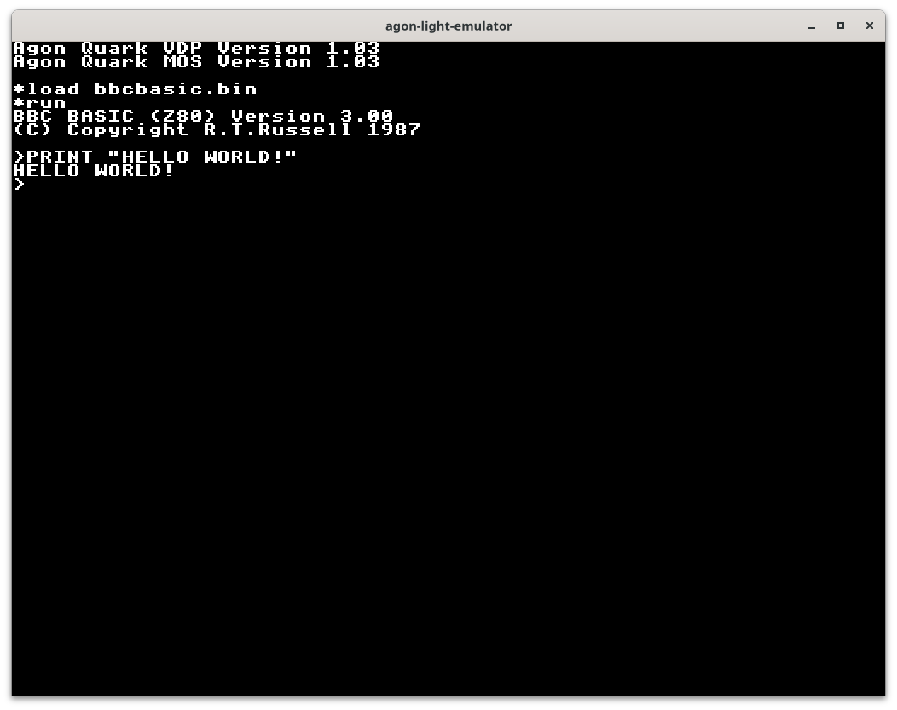

# agon-light-emulator

[](https://github.com/astralaster/agon-light-emulator/actions/workflows/rust.yml)



## Introduction

This is an emulator for the [agon light 8bit computer](https://www.thebyteattic.com/p/agon.html) by Bernardo Kastrup. Here you will only find the frontend of the emulator. It mimics the hardware design by also using two seperate modules the [ez80 cpu emulation](https://github.com/tomm/agon-cpu-emulator) and the [VDP emulation using SDL](https://github.com/astralaster/agon-light-vdp). The ez80 emulation done by Tom Morton can also be used standalone if you don't need the graphical capabilities of the VDP.

The repository also contains MOS.bin (agon operating system) and bbcbasic.bin for convenience. They are developed by [Dean Belfield](https://github.com/breakintoprogram).

## Motivation
Inspired by the great [Commander X16 emulator](https://github.com/x16community/x16-emulator) I started this project to make it easier to develop software for the agon light. The only thing available was [BBC SDL](https://www.bbcbasic.co.uk/bbcsdl/index.html) and although it is also bbcbasic it isn't that compatible. I choose Rust because I wanted to learn it and coincidentally I've found Tom Morton on the [agon light discord](https://discord.gg/Ef7JRs8tF3) who already was working on an ez80 emulation in Rust, too.

## Requirements
The emulator uses Rust and SDL. Look [here](https://github.com/Rust-SDL2/rust-sdl2) if you need help setting it up. Linux, Windows and MacOS are all supported.

## How to build

```shell
cargo build -r
```

## How to run

```shell
cargo run -r
```

## Missing features
* More keyboard layouts (currently only us)
* Color Redefinition (bbcbasic command COLOUR l,p)
* No speed limitation (runs as fast as possible)
* Not cycle accurate ez80 emulation
